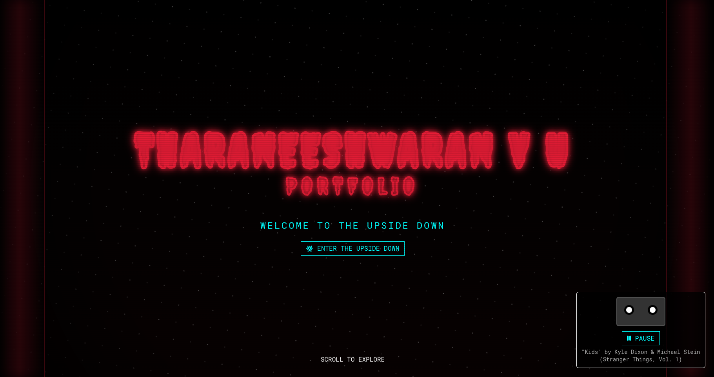

# **Welcome...** 🌲🛸🖤

Step into the **Upside Down**, Stranger. 👀  
This is my personal portfolio: a clean, standalone **HTML/CSS/JS** page generated by parsing my résumé.  
Originally built as an experiment while testing **Google’s Antigravity** (and wow… it handled the whole thing beautifully).

---

## 🧑‍💻 About Me

I'm **Tharan**, a developer who enjoys building responsive, accessible interfaces and experimenting with anything that pushes the web a little further into the unknown.  
Frontend, backend, UI/UX, Computer Vision, 3D, AI/ML — if it’s creative or technical, I’m in.

## 🌌 Want to See the Real Thing?

The live version of this portfolio is hosted on **GitHub Pages**:  
**https://eeshwarantharan.github.io/portfolio**

If you're curious how Google’s Antigravity handled the parsing and generation…  
go take a look, the page speaks for itself...

---

### Thanks for Visiting

Stay curious, stay creative…  
and try not to open any unexplained portals. 👹✨
